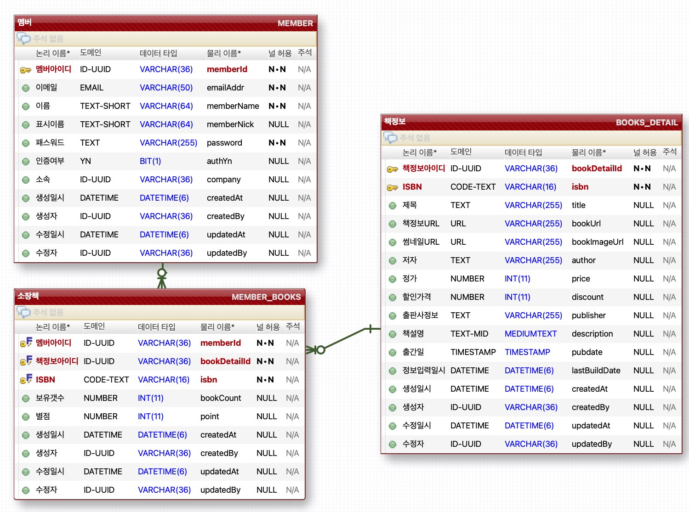

# booksbooksbooks
- 아주 작은 사이드 프로젝트 - 책 정보 공유 프로젝트
- 같이 해보실 분? : parksangdonews@gmail.com 으로 email.

## 작업 내용
- 23-06-07
  - H2 DB 로 설정 및 구동 확인
- 23-06-07
  - api , web 작업부분 머지
- 23-06-08 
  - ERD 작업
  - 엔티티 작업
- 23-06-09 : 
  - h2 db, ;MODE=MySQL 누락으로 인한 테이블 생성문제 해결(SB 2.1.10 이후이슈)
  - 로깅 설정
-

## ERD

